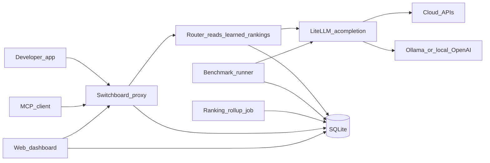
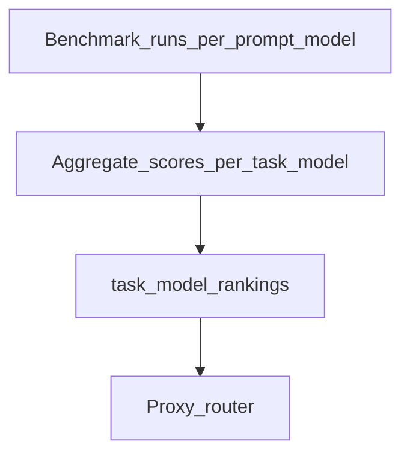

# Switchboard hackathon MVP

**Overview:** FastAPI proxy with learned per-task routing: benchmark-driven rollup (MVP) plus optional online learning from live traffic (production); LiteLLM, dual APIs (OpenAI + Anthropic), dashboard, MCP, Compose.

## Trackable tasks

| ID | Task |
|----|------|
| skeleton | Add Python project (FastAPI, SQLAlchemy, litellm), SQLite schema, seed data + Ollama model ids, config via env |
| proxy-adapters | OpenAI + Anthropic routes; router reads learned `task_model_rankings` (from benchmarks); LiteLLM `acompletion` + fallbacks |
| benchmarks | Benchmark sweep → `benchmark_runs`; rollup job updates learned `task_model_rankings` (per-task rank); router consumes rankings |
| dashboard | Vite/React: leaderboard + Preview routing (test prompt → classify task → show recommended model from rankings) |
| mcp | Stdio MCP server with tools wrapping proxy + rankings + optional admin trigger |
| docs | README + `.env.example`; curl examples; MCP Cursor config; golden path = Compose |
| compose | docker-compose: API, static dashboard, Ollama service or profile; volume for SQLite; printed URLs |
| online-learning | Post-MVP (or flag): traffic aggregates → blend with benchmark scores; privacy-safe metrics only; docs |

## Goals and constraints

- **Greenfield**: [README.md](../README.md) is the only product file at plan time; everything else is new.
- **Dual proxy surface**: Implement **both** [OpenAI Chat Completions](https://platform.openai.com/docs/api-reference/chat) (including streaming where feasible) and [Anthropic Messages](https://docs.anthropic.com/en/api/messages) so demos can swap either style of client. Internally, normalize to a single **messages + optional params** shape, then call **[LiteLLM](https://github.com/BerriAI/litellm)** (`litellm.acompletion` / streaming) with the **chosen model string**; map responses back at the edges (two adapters in, two adapters out).
- **Dynamic routing via LiteLLM**: Switchboard **does not** hand-roll per-provider HTTP. It resolves **which LiteLLM model id** to use (from **learned** per-task rankings + task tag), then delegates execution to LiteLLM so one code path covers OpenAI, Anthropic, **Ollama**, Groq, etc., per [LiteLLM providers](https://docs.litellm.ai/docs/providers/overview).
- **Learned routing (core product behavior)**: The router **does not** use a fixed static map of “task → best model.” **Quality signals** come from the **benchmark runner**: each run scores `(task_type, model)` pairs; a **rollup job** writes/updates `task_model_rankings` (score, rank, `updated_at`). The proxy’s router **always reads the latest** rankings for the active task tag (with fallbacks if empty). As new benchmark cycles complete, **which model is “best” per task changes**—that is the **dynamic learning** loop. Optional **decay** (e.g. exponential moving average or window over last N runs) can be specified so recent runs weigh more (fine-tuning).
- **Local models**: Register models such as `ollama/mistral`, `ollama/llama3.2`, or OpenAI-compatible `openai/` models with `api_base` pointing at LM Studio / vLLM. Document `OLLAMA_BASE_URL` (or LiteLLM env vars) for the hackathon laptop demo.
- **Hackathon scope**: Prefer one backend language, one DB, minimal auth (API key on proxy + dashboard), and seeded/mock data paths so judges see rankings even if **only local Ollama** is available (no cloud keys).

## High-level architecture

- **Router**: Chooses a **LiteLLM model string** using: optional **task tag** (HTTP header or body field stripped before forward), **`task_model_rankings` populated by the learning pipeline** (not hand-edited in steady state), and **fallback** order (e.g. next ranked model, or a configured default local model if cloud fails). On cold start, rankings may be **empty or uniform** until the first benchmark rollup completes—define seed behavior (e.g. alphabetical enabled models or `SWITCHBOARD_DEFAULT_MODEL`).
- **LiteLLM**: Single async call site for benchmarks and proxy; enable streaming where LiteLLM supports it for the selected provider.
- **Benchmark + rollup = learning**: Raw runs in `benchmark_runs` feed aggregates; **rollup** recomputes per `(task_type, model)` score and **global rank order** within each task. The router and dashboard both consume this single source of truth.

## Recommended stack (fits a 1–2 day MVP)

| Layer     | Choice                                                                          | Rationale                                                           |
| --------- | ------------------------------------------------------------------------------- | ------------------------------------------------------------------- |
| API       | **Python 3.11+**, **FastAPI**, **LiteLLM**                                      | Unified upstream calls; OpenAPI at `/docs`                          |
| DB        | **SQLite** (file in repo or `./data/`) with **SQLAlchemy 2** + Alembic optional | Zero infra; upgrade path to Postgres                                |
| Dashboard | **Vite + React + TypeScript**, **TanStack Query**, simple CSS or Tailwind       | Fast UI; calls proxy + small JSON admin API                         |
| MCP       | **Official MCP Python SDK** (stdio server)                                      | Standard for Cursor; tools call the same HTTP APIs as the dashboard |
| Config    | **Pydantic-settings**                                                           | `SWITCHBOARD_*` env vars; `.env.example`                            |

## Core components

### 1. Proxy (OpenAI + Anthropic) backed by LiteLLM

- **Routes**: e.g. `POST /v1/chat/completions`, `POST /v1/messages` (Anthropic path prefix configurable, e.g. `/anthropic/v1/messages`).
- **Task tag**: e.g. `X-Switchboard-Task: coding` or body field `switchboard_task` stripped before calling LiteLLM. If absent, use `default` task.
- **Routing policy (MVP)**: Resolve **LiteLLM model id** from `task_model_rankings` for that task; on failure, try next ranked model (small retry loop with timeouts). Optional circuit breaker (skip model after N failures for M minutes).
- **LiteLLM call**: After routing, invoke `litellm.acompletion(model=<resolved_litellm_string>, messages=..., stream=..., **kwargs)`; translate streaming chunks to OpenAI SSE or Anthropic stream format at the edge.
- **Secrets / env**: Standard LiteLLM env vars (`OPENAI_API_KEY`, `ANTHROPIC_API_KEY`, …) plus `OLLAMA_BASE_URL` (or per-model `api_base` in registry) so **local Ollama** works without cloud keys.
- **Model registry**: Static YAML or DB table listing **LiteLLM model ids** (e.g. `ollama/mistral`, `openai/gpt-4o-mini`, `anthropic/claude-3-5-sonnet-20241022`), display name, `enabled`, optional `api_base` override for local OpenAI-compatible servers. Benchmark runner uses the **same** strings as the proxy.

### 2. Benchmark generation and “live” ranking

- **Task types**: Seed a small set (`coding`, `reasoning`, `summarization`, `tool_use`, …) with 3–5 **prompt templates** each (synthetic but realistic).
- **Scoring (MVP)**:
  - **Automatic**: latency, token usage (if available), optional **LLM-as-judge** (one fixed “judge” model via env) with a short rubric JSON output—good for demo “scores.”
  - **Fallback**: If no judge key, rank by latency-only or a fixed heuristic so the leaderboard still updates.
- **Runner**: Async job (APScheduler or FastAPI `lifespan` + background task) on an interval (e.g. every 5–15 min) **or** manual `POST /admin/benchmarks/run` for demos.
- **Persistence**: Store each run row + roll up into `task_model_stats` (mean score, run count, `updated_at`) for fast dashboard queries.

### 3. Database (minimal schema)

- `task_types` — id, slug, label
- `registered_models` — id, **litellm_model_id** (unique), display_name, enabled, optional **api_base** / notes for local servers
- `benchmark_prompts` — id, task_type_id, prompt_text, rubric_hint (optional)
- `benchmark_runs` — id, prompt_id, model_id, score, latency_ms, tokens_in/out, raw_judge_json (optional), created_at
- `task_model_rankings` — task_type_id, model_id, score, rank, updated_at (materialized by job)

### 4. Web dashboard

- **Pages (MVP)**: Overview (proxy URL + copy snippet), **Leaderboard** by task (table + last updated), **Models** (toggle enabled), **Trigger benchmark** button, **Health** (last error per provider).
- **Backend**: Either FastAPI serves static build, or Vite dev proxy to FastAPI in dev. Same-origin CORS for local demo.

### 5. MCP server

- Separate process: **stdio MCP** listing tools such as:
  - `get_routing_context` — best models per task from DB/API
  - `proxy_chat_openai` / `proxy_messages_anthropic` — thin wrappers that POST to local Switchboard base URL with task tag
  - `trigger_benchmark_run` — admin-only if `SWITCHBOARD_ADMIN_TOKEN` matches
- Document `mcp.json` snippet pointing at the venv + module.

### 6. Developer ergonomics

- **README**: Env template, “replace `https://api.openai.com` with `http://localhost:8000/v1`” and Anthropic base URL note, task header examples.
- **Docker Compose** (optional stretch): one service for API + MCP build, volume for SQLite.

## Implementation order (suggested)

1. **Project skeleton**: `pyproject.toml`, FastAPI app, config, SQLite + models, seed task types + registry YAML.
2. **OpenAI adapter** end-to-end (non-streaming first), then streaming; then **Anthropic adapter** the same way.
3. **Routing + DB reads** for `task_model_rankings`; seed initial rankings from first benchmark or defaults.
4. **Benchmark runner** + admin endpoint + rollup job.
5. **React dashboard** wired to JSON endpoints.
6. **MCP server** package entrypoint + README.

## Risks and simplifications

- **Dual API**: Highest complexity; share one internal pipeline and test both paths with minimal fixtures.
- **Judge quality**: For demo, keep prompts short and rubric binary (pass/fail) to reduce variance.
- **Rate limits**: Throttle benchmark concurrency (semaphore per provider) to avoid 429s during live demo.

## What we will not do in MVP (unless time allows)

- User accounts, billing, encrypted key vault
- Distributed tracing
- Full evaluation harness (e.g. full MMLU); stick to small synthetic suites
